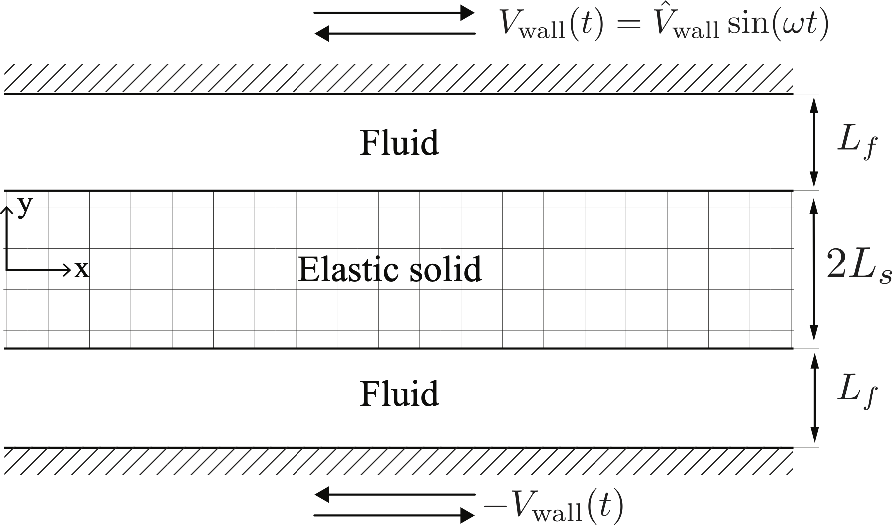
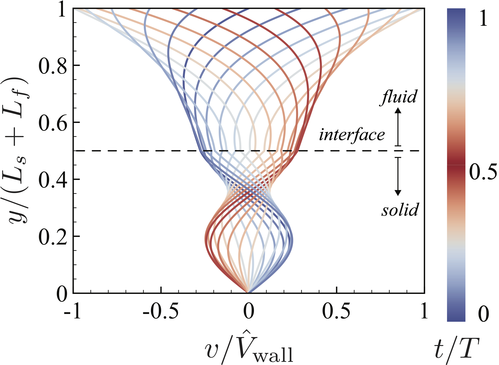
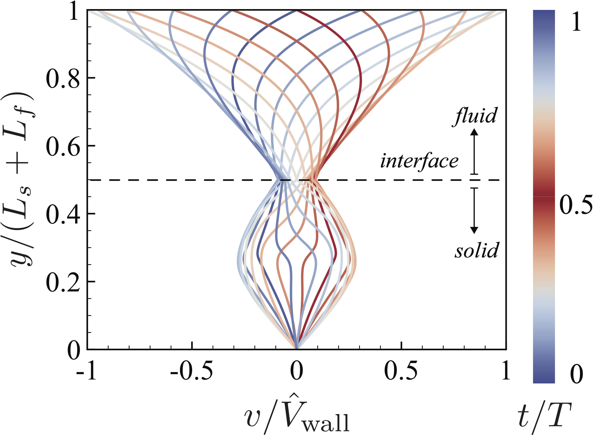

Parallel Slab Benchmark
&middot;
[](https://github.com/tp5uiuc/parallel_slab/actions/workflows/ci.yml)
[](https://codecov.io/gh/tp5uiuc/parallel_slab)
[](https://mit-license.org/)
[](https://www.python.org/)
=====

An elasto-hydrodynamic benchmark to test coupled FSI algorithms that involves slabs of fluid and elastic solid.

> :rocket: Before installing the package, check out an interactive, online version [at this link](https://gazzolalab.github.io/parallel_slab_sandbox/).

## Installation
For a system wide install, use
```sh
python3 -m pip install parallel-slab
```
For a local install, please clone this repository and execute the following in the repository directory.
```sh
python3 -m pip install --user .
```
You can then use one of the [examples](examples) for running a single simulation or
a parameter sweep of simulations. For more information see [Usage and examples](#usage-and-examples)

## Physical setup
The two-dimensional setup employs an elastic solid layer sandwiched between two fluid layers, in turn confined by two long planar walls,
whose horizontal oscillations drive a characteristic system response. This is shown in the figure below. The fluid is
Newtonian while the solid is made of either a neo-Hookean material (with stresses proportional linearly to deformations)
or a generalized Mooney--Rivlin material (with stresses varying non-linearly in response to deformations). This setting
admits a time periodic, one-dimensional analytical solution for neo-Hookean materials and a semi-analytical solution
(based on a sharp interface pseudo-spectral method) for a generalized Mooney--Rivlin solid.



Overall, this problem entails multiple interfaces, phases and boundary conditions interacting dynamically, and serves as
 a challenging benchmark to validate the long time behaviour, stability and accuracy of FSI solvers.

## Usage and examples
The simplest example runs a [single simulation](examples/run_single.py). This reads parameters of the simulation from
a user-defined YAML file (see [params.yaml](examples/params.yaml)). Two set of solid materials are available for use.
The following code should suffice to see some output:
```python
from parallel_slab import NeoHookeanSolution, GeneralizedMooneyRivlinSolution
from parallel_slab import run_and_plot_from_yaml

run_and_plot_from_yaml(
    NeoHookeanSolution,  # the type of solid material
    final_time=20.0   # final time of simulation, till periodic steady state
)

run_and_plot_from_yaml(
    GeneralizedMooneyRivlinSolution,  # the type of solid material
    final_time=20.0   # final time of simulation, till periodic steady state
)
```
More examples including the one above are given in the example file. Running the script above should produce these two
image files (along with other data artefacts, which are under the user's control).

#### neo-Hookean solid


#### generalized Mooney--Rivlin solid


## Numerical algorithms
Details on the algorithms employed in the two examples shown above can be found in the following technical paper.
If you are employing this benchmark, please cite the work below.

<a id="1">[1]</a>
TODO : CITE OUR PAPER HERE


## Running tests
First install the package with optional dependencies
```sh
python3 -m pip install parallel-slab[extras]
```
Once that is done, install the test requirements using
``` sh
python3 -m pip install -r tests/requirements.txt
```
from the repo directory.This package uses `py.test` for running unit and integration tests.
To run the tests, execute
```sh
python3 -m pytest
```
from the repository directory.
